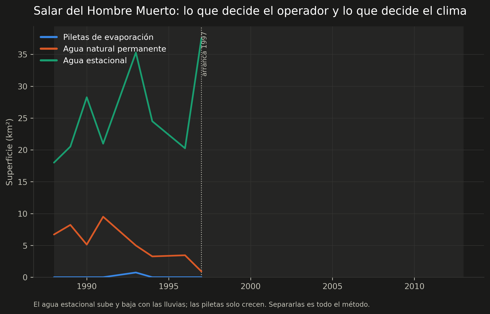

# Caso 1 — La expansión de las piletas de evaporación

Una operación de litio de salmuera es, en superficie, un sistema de piletas: se
bombea salmuera del subsuelo y se la deja evaporar al sol durante uno o dos años,
concentrándola de pileta en pileta hasta que sirve para producir. Cuanta más
producción, más superficie de piletas — con reservas, que están en
[Límites](limites.md).

Eso se puede medir desde el espacio, y **se puede medir hacia atrás**: el archivo
de Landsat llega a 1985, mucho antes de que existiera la mayoría de estas
operaciones.

---

## La trampa

El primer intento es obvio y está mal. Se calcula un índice de agua sobre una
imagen reciente, se umbraliza, y se cuenta superficie. Sobre el Salar del Hombre
Muerto en 2024 eso da **73,6 km²**.

El problema es que el núcleo de un salar está permanentemente húmedo por
naturaleza. La salmuera aflora, hay lagunas, la costra está saturada. Un índice de
agua no distingue eso de una pileta construida.

La prueba de que el número está mal es temporal: aplicado a 1990 —siete años antes
de que Fénix existiera— el mismo método devuelve **23 km² de "piletas"**.

*Las tres superficies del salar. El agua estacional (verde) sube y baja con las
lluvias sin relación con la operación: 1993 fue un año húmedo y 1998 uno seco.
Las piletas (azul) solo crecen. Separarlas es todo el método.*

## La corrección

Una pileta no es superficie mojada: es superficie que **pasó a estar mojada de
forma permanente y antes no lo estaba**. Se compara cada año contra una línea de
base construida con los años **secos** previos a la operación — lo que sigue
mojado hasta en un año seco es agua natural de verdad.

El detalle está en [Método](metodo.md), pero las dos decisiones que más mueven el
resultado son:

1. **Frecuencia anual de inundación** en vez de una escena suelta. Una pileta
   operada está bajo salmuera todo el año; una laguna natural respira con la
   estación.
2. **Agua = índice alto Y infrarrojo cercano bajo.** Sin la segunda condición, la
   nieve y la costra de sal seca se cuentan como agua: las tres son brillantes en
   verde y oscuras en SWIR, y solo el NIR las separa.

## El resultado

### Mapa: la historia de la expansión en una sola imagen

Cada píxel pintado con el año en que se volvió pileta. Las capas de
OpenStreetMap se pueden encender para comparar contra una referencia
independiente.

<iframe src="assets/mapa_hombre_muerto.html" width="100%" height="580"
        style="border:1px solid #444;border-radius:6px"></iframe>

## Validación

**Control negativo.** Las lagunas naturales con nombre del Salar de Atacama
—Chaxa, Barros Negros, Burro Muerto— no tendrían que aparecer como piletas. La
fracción que sí aparece mide directamente cuánta agua natural se está colando.

**Referencia positiva.** OpenStreetMap tiene 388 poligonales de piletas
digitalizadas sobre Atacama, hechas por terceros sin relación con este trabajo.
Contra eso se mide precisión y recall. En los salares argentinos esas poligonales
no existen, así que ahí la validación es temporal —superficie prácticamente nula
antes del arranque de cada operación— y no cuantitativa.

**Prueba temporal.** Es la que puede fallar, y por eso vale: en Hombre Muerto la
superficie de piletas tiene que ser ~0 antes de 1997.

!!! warning "El límite que hay que tener presente"
    Las cifras se sostienen **desde 2013**. Landsat 5 y 7 se saturan sobre la
    costra de sal y el producto descarta esos píxeles, así que los años anteriores
    sirven como contexto pero no para medir tasas de crecimiento.
    [Por qué](limites.md#1-la-serie-cuantitativa-arranca-en-2013-no-en-1985).
