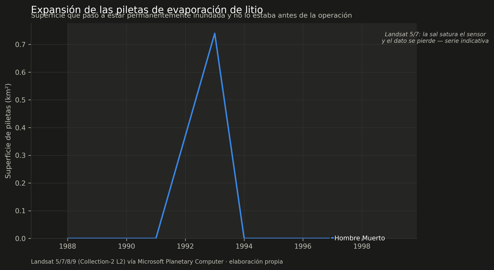

# Caso 1 — La expansión de las piletas de evaporación

Una operación de litio de salmuera es, en superficie, un sistema de piletas: se
bombea salmuera del subsuelo y se la deja evaporar al sol durante uno o dos años,
concentrándola de pileta en pileta hasta que sirve para producir. Cuanta más
producción, más superficie de piletas — con reservas, que están en
[Límites](limites.md).

Eso se puede medir desde el espacio, y **se puede medir hacia atrás**: el archivo
de Landsat llega a 1985, mucho antes de que existiera la mayoría de estas
operaciones.

---

## La trampa

El primer intento es obvio y está mal. Se calcula un índice de agua sobre una
imagen reciente, se umbraliza, y se cuenta superficie. Sobre el Salar del Hombre
Muerto en 2024 eso da **73.6 km²**.

El problema es que el núcleo de un salar está permanentemente húmedo por
naturaleza. La salmuera aflora, hay lagunas, la costra está saturada. Un índice de
agua no distingue eso de una pileta construida.

La prueba de que el número está mal es temporal: aplicado a 1990 —siete años antes
de que Fénix existiera— el mismo método devuelve **23 km² de "piletas"**.

*Las tres superficies del salar. El agua estacional (verde) sube y baja con las
lluvias sin relación con la operación: 1993 fue un año húmedo y 1998 uno seco.
Las piletas (azul) solo crecen. Separarlas es todo el método.*

## La corrección

Una pileta no es superficie mojada: es superficie que **pasó a estar mojada de
forma permanente y antes no lo estaba**. Se compara cada año contra una línea de
base construida con los años **secos** previos a la operación — lo que sigue
mojado hasta en un año seco es agua natural de verdad.

El detalle está en [Método](metodo.md), pero las dos decisiones que más mueven el
resultado son:

1. **Frecuencia anual de inundación** en vez de una escena suelta. Una pileta
   operada está bajo salmuera todo el año; una laguna natural respira con la
   estación.
2. **El umbral de agua se calibró contra las 388 piletas digitalizadas de OSM**,
   no se eligió a ojo. La primera versión sumaba una condición sobre el infrarrojo
   cercano para descartar nieve, y resultó desastrosa: la salmuera concentrada es
   tan brillante en el NIR que satura el sensor, así que esa condición borraba
   justo las piletas más maduras y el recall caía a 0.037. Ver
   [Método](metodo.md#2-el-umbral-de-agua-se-calibro-contra-verdad-de-campo).

## El resultado

Superficie de piletas en 2025, el último año calendario cerrado:

| Salar | Piletas (km²) | Operación |
|---|---|---|
| Atacama (Chile) | **30.3** | SQM y Albemarle desde 1984 |
| Olaroz-Cauchari | **9.2** | desde 2015 y 2023 |
| Hombre Muerto | **9.0** | Fénix desde 1997 |
| Rincón | 0.4 | sin producción comercial |
| Centenario-Ratones | 0.0 | desde fines de 2024 |

Atacama tiene más del triple de superficie de piletas que cualquier salar
argentino, y cuatro décadas de ventaja. La curva argentina recién se empina
después de 2010.

!!! warning "2026 no está en el gráfico"
    El año en curso tiene menos pasadas y su frecuencia anual sale más baja, así
    que ponerlo al lado de años cerrados inventa una caída que no existe: en
    Atacama daba 30.3 km² en 2025 contra 11.0 en el 2026 incompleto. Los años
    parciales quedan marcados en los datos y fuera de las figuras.

### Mapa: la historia de la expansión en una sola imagen

Cada píxel pintado con el año en que se volvió pileta. Se pueden encender las
capas de OpenStreetMap para comparar contra una referencia independiente: en
naranja las piletas digitalizadas, en verde las lagunas naturales que sirven de
control negativo.

<iframe src="../assets/mapa_atacama.html" width="100%" height="580"
        style="border:1px solid #444;border-radius:6px"></iframe>

Mapas equivalentes de los demás salares:
[Hombre Muerto](assets/mapa_hombre_muerto.html) ·
[Olaroz-Cauchari](assets/mapa_olaroz_cauchari.html) ·
[Rincón](assets/mapa_rincon.html)

## La prueba que más pesa: el desfasaje

Si la superficie de piletas mide algo real, debería predecir la producción — pero
**no en el mismo año**. La salmuera tarda entre 12 y 24 meses en recorrer la
cadena de piletas, así que el área tiene que adelantarse.

Cruzando la superficie de los salares argentinos con las exportaciones nacionales
declaradas (Secretaría de Minería, informe de junio de 2025):

| Desfasaje | Correlación |
|---|---|
| 0 años | +0.385 |
| 1 año | +0.545 |
| **2 años** | **+0.814** |

La correlación crece de forma monótona y llega al máximo justo donde la física lo
predice. Eso es bastante más convincente que un coeficiente suelto: un artefacto
no tendría por qué elegir el desfasaje correcto.

No se reporta p-valor. Son once puntos y las dos series crecen en el tiempo;
poner un p daría una falsa sensación de rigor.

## Validación, con lo bueno y lo malo

**Contra las piletas digitalizadas.** OpenStreetMap tiene 388 poligonales de
piletas sobre Atacama, hechas por terceros sin relación con este trabajo. Sobre
2025: **precisión 0.61 · recall 0.43 · IoU 0.34**. O sea, encuentra algo menos de
la mitad de la superficie digitalizada, y de lo que marca, seis de cada diez está
dentro de un polígono de OSM.

**El control negativo, que es donde aparece el problema.** Las lagunas naturales
con nombre —Chaxa, Barros Negros, Burro Muerto— no tendrían que entrar en la
máscara de piletas. En Hombre Muerto la contaminación es **0.0%**. En Atacama es
**57.5%**: más de la mitad de la superficie de lagunas naturales mapeadas cae
adentro.

Esa asimetría no es casual, y vale la pena entenderla:

| Salar | Línea de base | Contaminación de lagunas |
|---|---|---|
| Hombre Muerto | 1988-1994, **previa a la operación** | 0.0% |
| Centenario-Ratones | 2006-2020, previa | 0.0% |
| Rincón | sin base previa útil | 0.0% |
| Olaroz-Cauchari | 2004-2010, previa | 12.8% |
| **Atacama** | 1991-1998, **NO previa** (SQM opera desde 1984) | **57.5%** |

**El método depende de tener una línea de base anterior a la operación.** Donde la
hay, separa limpio. En Atacama no puede haberla: SQM arrancó en 1984 y Landsat
empieza en 1985, así que la "base" ya incluye piletas y lagunas fluctuantes, y el
descuento no funciona igual.

La ironía es incómoda y hay que decirla: **el único salar con verdad de campo es
también el único donde el método no puede aplicarse en sus mejores condiciones.**
La cifra de Atacama hay que leerla como orientativa. Las argentinas, que sí tienen
base previa, son las que se sostienen.

**Prueba temporal.** Es la que puede fallar, y por eso vale: en Hombre Muerto la
superficie de piletas da prácticamente cero antes de 1997, cuando arrancó Fénix.
Y en el Rincón, que no tiene producción comercial, da 0.4 km² — que es el orden
del ruido.

!!! warning "El límite que hay que tener presente"
    Las cifras se sostienen **desde 2013**. Landsat 5 y 7 se saturan sobre la
    costra de sal y el producto descarta esos píxeles, así que los años anteriores
    sirven como contexto pero no para medir tasas de crecimiento.
    [Por qué](limites.md#1-la-serie-cuantitativa-arranca-en-2013-no-en-1985).
