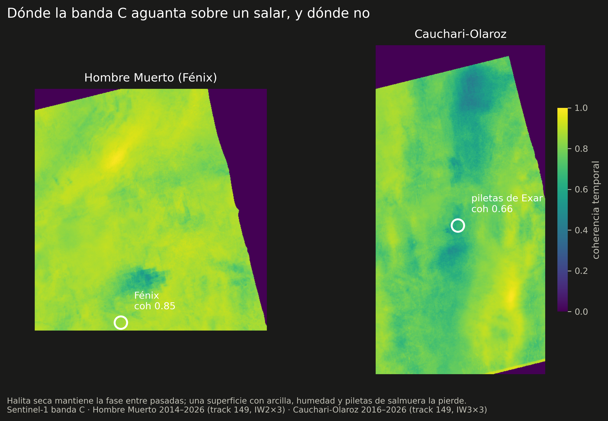
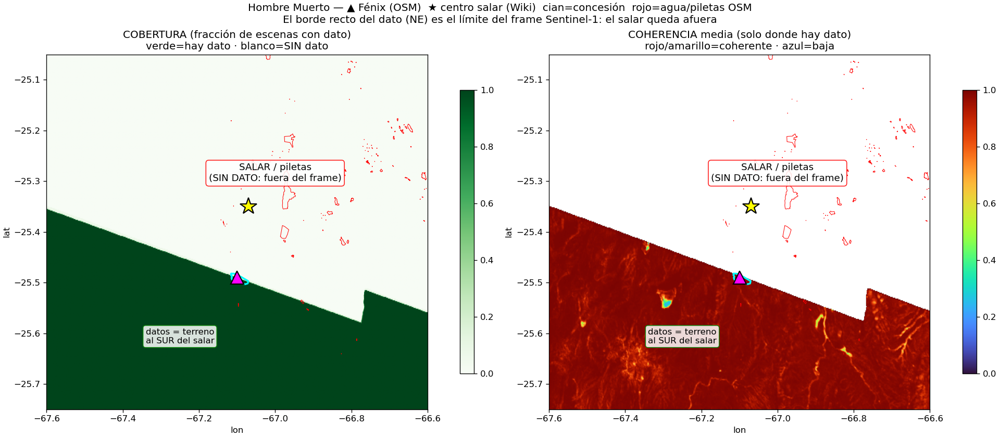
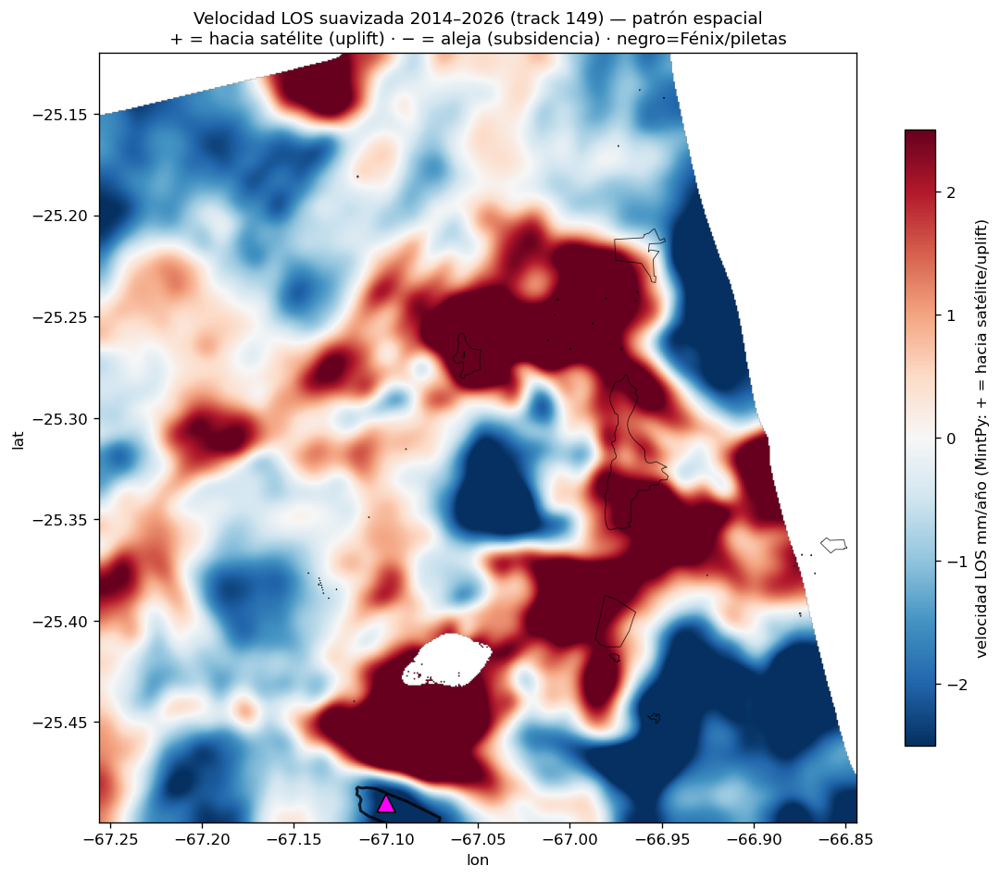
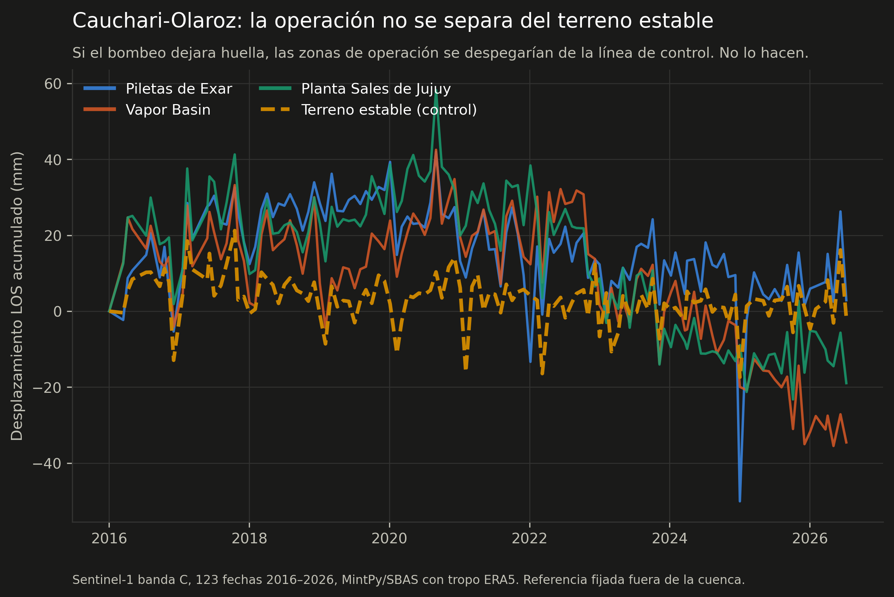

# Caso 2 — ¿Se mueve el salar cuando se bombea salmuera?

La hipótesis es directa: si se extrae salmuera más rápido de lo que el sistema
recarga, el terreno se compacta y baja. Está medido así en el Salar de Atacama,
donde Delgado y colegas encuentran ~1 cm/año de subsidencia acotada al área de
extracción[^delgado]. La pregunta es si se ve en los salares argentinos.

Se midieron dos, con el mismo sensor, el mismo track y el mismo procesamiento.
**En uno se puede medir y en el otro no** — y la conclusión más útil de este caso
no es cuánto se hunde cada salar, sino que la diferencia entre los dos se sabe de
antemano, mirando la coherencia.

[^delgado]: Delgado, F., Shreve, T., Borgstrom, S., León-Ibañez, P., Castillo, J.
    y Poland, M. (2024). *A global assessment of SAOCOM-1 L-band stripmap data for
    InSAR characterization of volcanic, tectonic, cryospheric, and anthropogenic
    deformation.* IEEE TGRS. [doi:10.1109/TGRS.2024.3423792](https://doi.org/10.1109/TGRS.2024.3423792)

---

## Dónde la banda C aguanta sobre un salar

| | Hombre Muerto (Fénix) | Cauchari-Olaroz |
|---|---|---|
| Superficie | halita seca | arcilla, humedad y piletas |
| Coherencia temporal sobre la operación | **0.85** | **0.66** |
| Serie | 135 fechas, 2014–2026 | 123 fechas, 2016–2026 |
| ¿Se puede medir la operación? | **Sí** | **No** |

*(Coherencia media en una ventana de 9×9 píxeles centrada en la operación.)*

Es una diferencia física, no metodológica. La halita seca de Hombre Muerto
mantiene la fase entre pasadas separadas por semanas; una superficie con arcilla,
humedad variable y piletas de salmuera la pierde. Y esto es **verificable antes de
procesar nada**: basta mirar la coherencia del stack.

---

## Hombre Muerto: hay señal, y es chica

**Sentinel-1 banda C**, track 149 ascendente multi-burst, **135 fechas entre
octubre de 2014 y mayo de 2026**, MintPy/SBAS con corrección troposférica ERA5.

### Primero, el error que casi cierra el caso

La primera corrida usó el **track 83 descendente** y concluyó que el salar
decorrelacionaba: 16% de píxeles coherentes, **cero** sobre la operación. La
lectura tentadora era "la banda C no sirve sobre sal húmeda".

Era falso: **el track 83 no cubre el salar**. Su huella corta al sur de Fénix.

*El dato (verde) llega solo hasta una diagonal recta, que es el borde del frame.
El salar, las piletas (contorno rojo) y Fénix (▲) quedan al norte, sin dato.
Coherencia cero porque no había nada que medir, no por la sal.*

!!! warning "La moraleja operativa"
    Un cero puede ser un resultado o puede ser un agujero de cobertura, y los dos
    se ven igual en el mapa. Antes de escribir "no hay señal", hay que verificar
    que el sensor estuvo mirando el lugar. Esta lección se aplicó después en
    Cauchari-Olaroz y en la búsqueda de banda L histórica, donde vuelve a aparecer
    la misma trampa.

### Con el track correcto

| Métrica | Track 83 (mal ubicado) | **Track 149 (correcto)** |
|---|---|---|
| Cobertura sobre el salar | ~0 (fuera del frame) | **completa** |
| Píxeles coherentes (coh. temporal > 0.7) | ~16% | **~85% del AOI** |
| Interferogramas / fechas | 136 / 88 | **399 / 135** (2014–2026) |

Promediando por zona y restando el retardo atmosférico común, aparece una
tendencia sostenida:

| Zona | Acumulado 2014–2026 | Tasa |
|---|---|---|
| Hotspot NE (−66.99, −25.37) | ~25 mm | ~2.5 mm/año |
| Concesión Fénix | ~18 mm | ~1.1 mm/año |
| Piletas E (−66.9) | ~17 mm | ~1.3 mm/año |

<iframe src="../assets/demo_subsidencia.html" width="100%" height="560"
        style="border:1px solid #444;border-radius:6px"></iframe>

Los límites, sin maquillar: **la señal está en el piso de ruido atmosférico**
(1–2.5 mm/año es del orden del ruido por píxel, y solo se ve limpia promediando
por zona); **el signo no está confirmado** —con la convención de MintPy estos
valores serían uplift relativo, y podría ser una mezcla real de sal acumulándose
en las piletas y extracción hundiendo otra subzona—; y con una sola geometría no
se puede descomponer en vertical y este-oeste.

---

## Cauchari-Olaroz: resultado nulo

Mismo track 149, tres bursts contiguos de IW3, **123 fechas 2016–2026**, mismo
procesamiento. La cobertura se verificó punto por punto antes de encolar.

Las tres zonas de operación y el terreno estable de control oscilan en la misma
banda, sin separarse. Comparando la ventana 2018–2020:

| Zona | Acumulado 2018–2020 | Coherencia |
|---|---|---|
| Piletas de Exar | +15.0 mm | 0.67 |
| Vapor Basin | +32.6 mm | 0.70 |
| Planta Sales de Jujuy | +22.2 mm | 0.62 |
| **Terreno estable (control)** | **+14.7 mm** | 0.80 |

**La operación no se distingue del control.** Todo el campo se corre junto, que
es firma de modo común —atmósfera y referencia—, no de deformación localizada.

Y sobre la serie completa las tasas aparentes son mutuamente incoherentes: Vapor
Basin da −3.7 mm/año y Cauchari sur **+3.2** mm/año. Partes vecinas del mismo
salar moviéndose en direcciones opuestas con magnitudes parecidas, y con
dispersión residual de 9 a 13 mm alrededor de la tendencia. Eso es ruido.

### Una medición publicada que no se reproduce

Existe un antecedente sobre este mismo salar: Lenardón, Farías, Seppi y
Carignano[^lenardon] reportan subsidencia alrededor de las baterías de pozos, con
acumulados 2018–2020 **entre +12 y −17 cm** — un rango de 290 mm.

Sobre la misma ventana, mi rango espacial en todo el AOI coherente es de **96 mm**,
con mediana +19 mm. Si existiera deformación de esa magnitud, debería verla: es
tres veces mi rango completo.

No puedo afirmar que estén equivocados sin ver su procesamiento, y hay que decirlo
así. Pero la diferencia tiene una explicación plausible: es un trabajo de workshop
que usa la herramienta SBAS de un clic de ASF Vertex, sin enmascarar por
coherencia, sobre una superficie que acá mide 0.62–0.72. **Un desenrollado de fase
defectuoso sobre píxeles decorrelacionados produce exactamente saltos de
decímetros**, y es el modo de falla más común de esta técnica.

[^lenardon]: Lenardón, M., Farías, C. A., Seppi, S. A. y Carignano, C. A. (2023).
    *Terrain Subsidence in the Salar de Olaroz (Jujuy, Argentina) Caused by
    Lithiferous Brine Extraction, Detected by Multi-Temporal SAR Interferometry.*
    XX Workshop on Information Processing and Control.
    [IEEE Xplore](https://ieeexplore.ieee.org/document/10530767/)

---

## Qué deja el par de casos

1. **La coherencia decide antes que el método.** Sobre halita seca la banda C
   sirve; sobre un salar con arcilla y piletas, no. Se sabe mirando el stack, sin
   procesar la serie entera.
2. **Un resultado nulo bien acotado vale.** Decir "acá no se puede medir con este
   sensor, y este es el piso de ruido" es más útil que forzar un número.
3. **Una cifra publicada no es una verificación.** El único modo de saber si un
   resultado se sostiene es rehacerlo.

### Qué destrabaría cada uno

Para **Hombre Muerto** el cuello de botella es la atmósfera, no la coherencia:
GACOS (corrección troposférica más fina que ERA5, gratis) y **banda L** —SAOCOM de
CONAE, o ALOS-1 para la historia 2007–2011, que se baja sin trámite—. La banda L
además resolvería el signo.

Para **Cauchari-Olaroz** el problema es la longitud de onda: la banda C no aguanta
esa superficie. Solo la banda L tiene chance. Y acá sí pasan tres geometrías —dos
tracks ascendentes y uno descendente— así que si hubiera señal, se podría
descomponer en vertical y este-oeste.

!!! info "Procesamiento completo"
    Scripts, configuraciones y series están en el repo hermano
    [litio-subsidencia](https://mpodeley.github.io/litio-subsidencia/).
