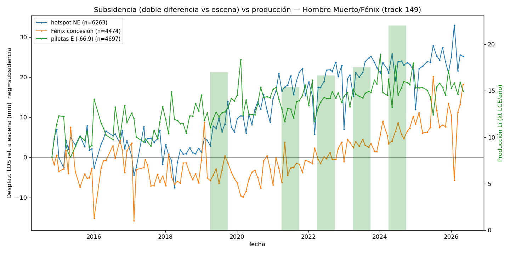

# Caso 2 — ¿Se mueve el salar cuando se bombea salmuera?

**Salar del Hombre Muerto** (operación Fénix), **Sentinel-1 banda C**, track 149
ascendente multi-burst, **135 fechas entre octubre de 2014 y mayo de 2026**,
procesado con MintPy/SBAS y corrección troposférica ERA5.

La hipótesis es directa: si se extrae salmuera más rápido de lo que el sistema
recarga, el terreno se compacta y baja. Está medido así en el Salar de Atacama.
La pregunta es si se ve en Hombre Muerto.

---

## Primero, el error que casi cierra el caso

La primera corrida usó el **track 83 descendente** y concluyó que el salar
decorrelacionaba: 16 % de píxeles coherentes, **cero** sobre la operación. La
lectura tentadora era "la banda C no sirve sobre sal húmeda".

Era falso, y por un motivo bastante más tonto: **el track 83 no cubre el salar**.
Su huella corta al sur de Fénix.

*El dato (verde) llega solo hasta una diagonal recta, que es el borde del frame.
El salar, las piletas (contorno rojo) y Fénix (▲) quedan al norte, sin dato.
Coherencia cero porque no había nada que medir, no por la sal.*

!!! warning "La moraleja operativa"
    Un cero puede ser un resultado o puede ser un agujero de cobertura, y los dos
    se ven igual en el mapa. Antes de escribir "no hay señal", hay que verificar
    que el sensor estuvo mirando el lugar.

## Con el track correcto, el salar sí es coherente

Repedidos los datos como multi-burst centrados en la operación:

| Métrica | Track 83 (mal ubicado) | **Track 149 (correcto)** |
|---|---|---|
| Cobertura sobre el salar | ~0 (fuera del frame) | **completa** |
| Píxeles coherentes (coh. temporal > 0,7) | ~16 % | **~85 % del AOI** |
| Coherencia sobre la concesión de Fénix | 0 % (sin dato) | **100 %** (coh. 0,96) |
| Interferogramas / fechas | 136 / 88 | **399 / 135** (2014–2026) |

La halita árida da alta coherencia, como se esperaba. El problema nunca fue la
banda C.

## El resultado, y cuánto pesa

*Velocidad en línea de vista (mm/año). A nivel píxel el campo es **mayormente
ruido espacialmente correlacionado**: turbulencia atmosférica de la Puna a
4.000 m. No hay una cubeta de subsidencia limpia. El piso de ruido ronda los
2 mm/año, o sea del mismo orden que la señal buscada.*

Promediando por zona y restando el retardo atmosférico común, aparece una
tendencia sostenida:

| Zona | Acumulado 2014–2026 | Tasa |
|---|---|---|
| Hotspot NE (−66,99, −25,37) | ~25 mm | ~2,5 mm/año |
| Concesión Fénix | ~18 mm | ~1,1 mm/año |
| Piletas E (−66,9) | ~17 mm | ~1,3 mm/año |

### Mapa interactivo

<iframe src="../assets/demo_subsidencia.html" width="100%" height="560"
        style="border:1px solid #444;border-radius:6px"></iframe>

---

## Los límites, sin maquillar

- **La señal está en el piso de ruido.** 1–2,5 mm/año es del orden del ruido
  atmosférico por píxel. Solo se ve limpia promediando por zona. Es un indicio
  sostenido, no una medición cerrada.
- **El signo no está confirmado.** Con la convención de MintPy (+ = hacia el
  satélite) estos valores positivos serían **uplift relativo**, no subsidencia.
  HyP3 usa la convención opuesta. Antes de afirmar la dirección hay que resolverlo
  — y podría ser una mezcla real: acumulación de sal en las piletas levantando una
  zona mientras la extracción hunde otra.
- **El cruce con producción es ilustrativo.** La serie de producción declarada de
  Fénix tiene seis años y ninguno verificado contra fuente primaria.
- **Una sola geometría.** Con solo track ascendente no se puede descomponer el
  movimiento en vertical y este-oeste.

## Qué destrabaría el caso

El cuello de botella pasó a ser la atmósfera, no la coherencia:

1. **GACOS** — corrección troposférica más fina que ERA5. Gratis, el pedido está armado.
2. **Banda L (SAOCOM de CONAE, o NISAR)** — más coherencia y desenrollado robusto,
   que es lo que permite estimar mejor la fase atmosférica. Es la palanca de fondo.
3. **Un track descendente** — para separar vertical de este-oeste.

!!! info "Procesamiento completo"
    El detalle del pipeline, los scripts y la serie completa están en el repo
    hermano [litio-insar](https://mpodeley.github.io/litio-insar/).
